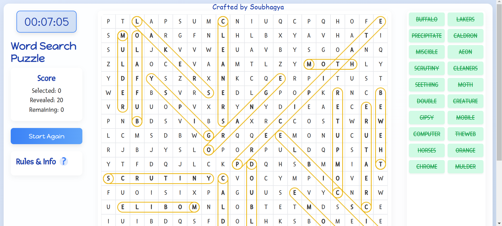

# Word Search Puzzle

A fun and interactive word search puzzle game built with HTML, CSS, and JavaScript. Find hidden words in a grid of letters and test your vocabulary skills! [Click here to play](https://soubhagya2001.github.io/Word-Search-Game/)

---

## Features

- **Interactive Grid**: Click and drag to select words in the grid.
- **Multiple Directions**: Words can be hidden in 8 directions (N, S, E, W, NE, NW, SE, SW).
- **Score Tracking**: Track your progress with a scoreboard showing selected, revealed, and remaining words.
- **Reveal Button**: Reveal unselected words with a single click.
- **Timer**: A stopwatch tracks how long it takes to complete the puzzle.
- **Responsive Design**: Works on both desktop and mobile devices.

---

## How to Play

1. **Find Words**: Look for words listed on the right side of the screen in the grid of letters.
2. **Select Words**: Click and drag over the letters to select a word.
   - Correctly selected words will turn green and be struck through in the list.
3. **Reveal Words**: Click the "Reveal Unselected Words" button to highlight remaining words in yellow.
4. **Restart**: After revealing all words, click "Start Again" to refresh the page and start a new game.

---

## Rules

- Words can be in the following directions:
  - **N (North)**: Up
  - **S (South)**: Down
  - **E (East)**: Right
  - **W (West)**: Left
  - **NE (Northeast)**: Up-Right
  - **NW (Northwest)**: Up-Left
  - **SE (Southeast)**: Down-Right
  - **SW (Southwest)**: Down-Left
- Selected words turn green and are struck through in the list.
- Use the "Reveal Unselected Words" button to highlight remaining words in yellow.

---

## Setup

### Open the Project:

1. Open the `index.html` file in your browser.

### Play the Game:

- Start finding words in the grid and enjoy the game!

---

## Technologies Used

- **HTML**: Structure of the game.
- **CSS**: Styling and layout.
- **JavaScript**: Game logic and interactivity.
- **jQuery**: Simplified DOM manipulation.

---

## Code Structure

- **`index.html`**: Main HTML file containing the structure of the game.
- **`style.css`**: CSS file for styling the game.
- **`script.js`**: JavaScript file containing the game logic.
